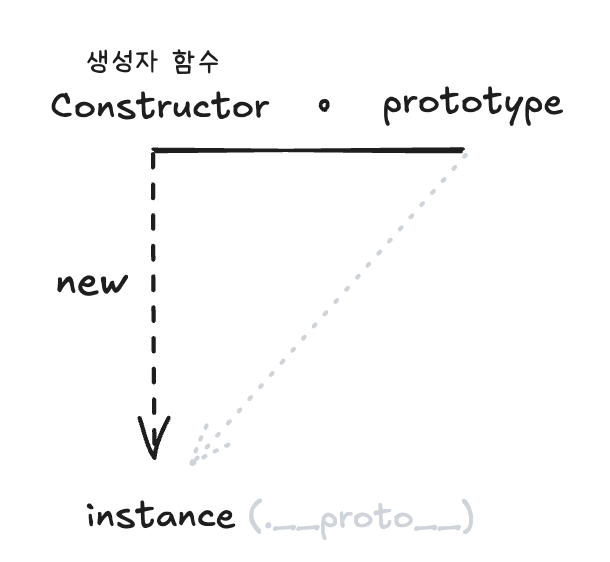
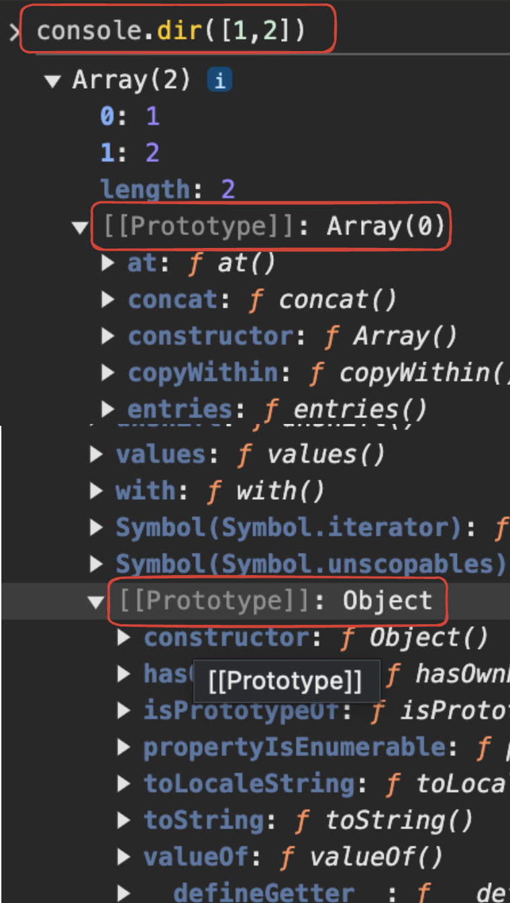
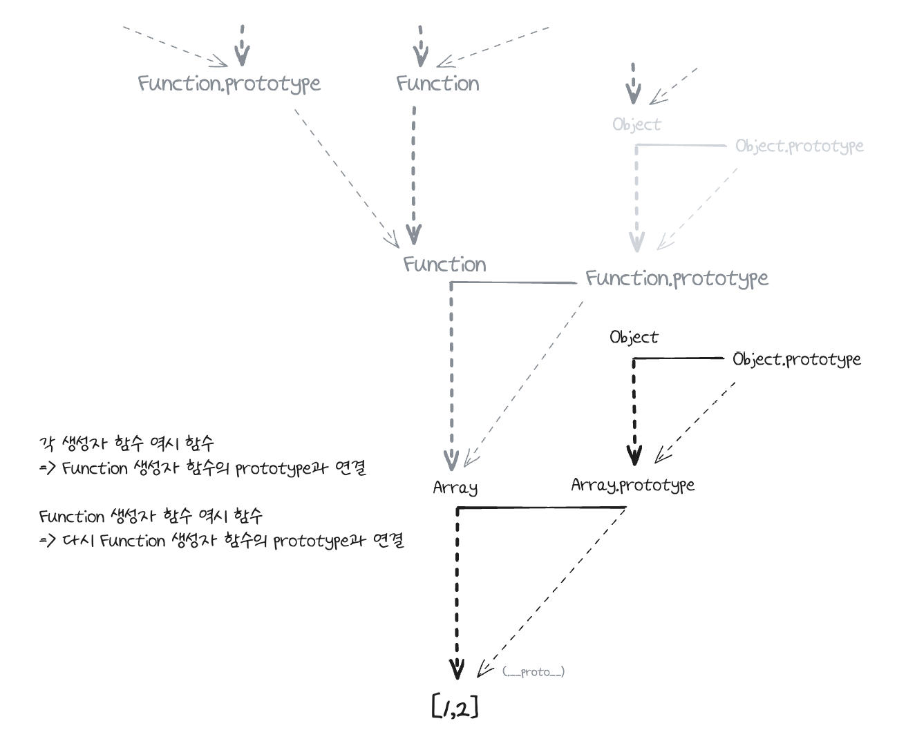
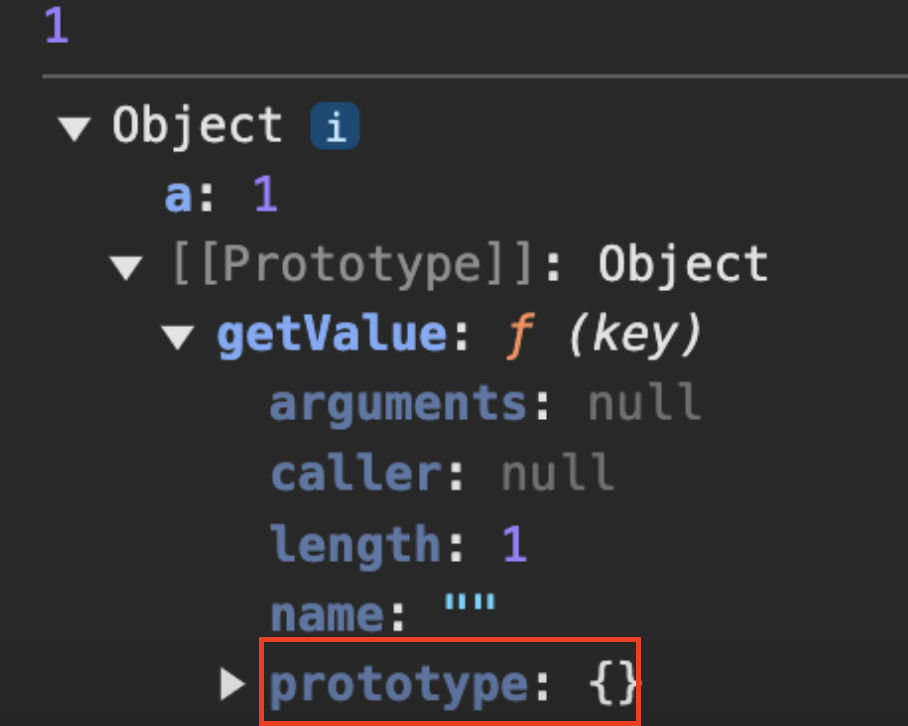
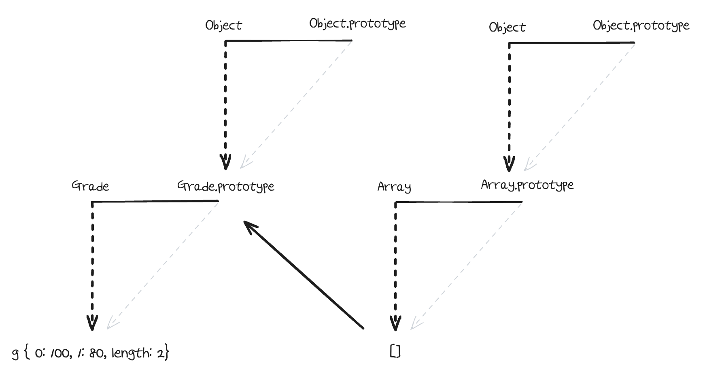
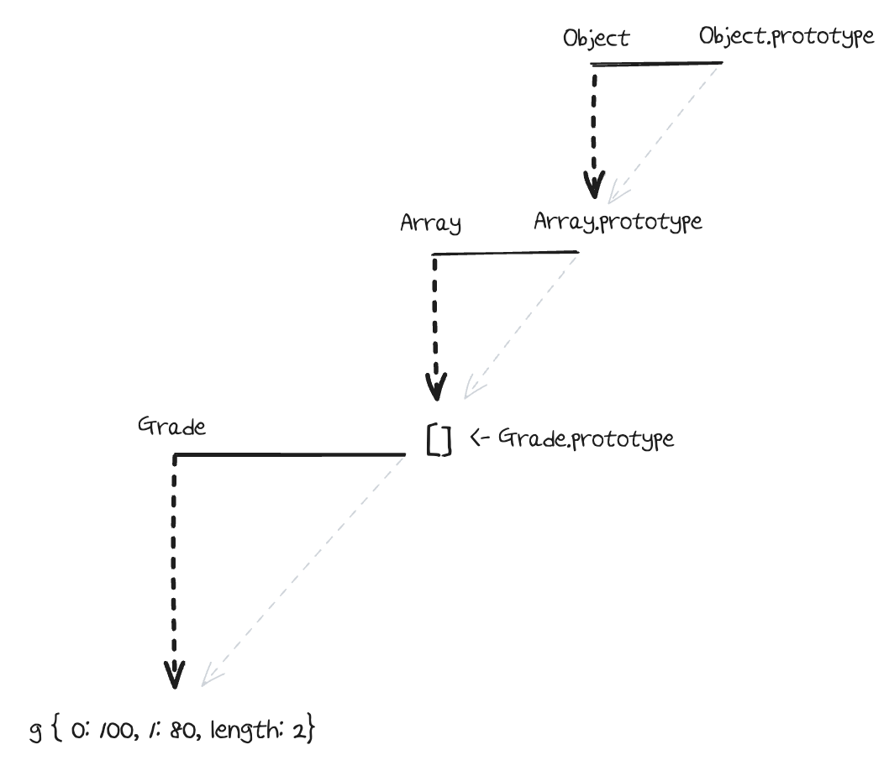

# 1. 프로토타입의 개념 이해

- 자바스크립트는 <ruby><span>프로토타입</span><rt>prototype</rt></ruby> 기반 언어
- 클래스 기반 언어에서는 `상속`을 사용하지만 프로토타입 기반 언어에서는 어떤 객체를 <ruby><span>원형</span><rt>prototype</rt></ruby>으로 삼고 이를 복제(참조)하는 방식으로 상속과 비슷한 효과를 냄

## 1-1. constructor, prototype, instance

| 코드                                         | 도식                                                                      |
| -------------------------------------------- | ------------------------------------------------------------------------- |
| <pre>var instance = new Constructor();</pre> |  |

- 어떤 <ruby><span>생성자 함수</span><rt>Constructor</rt></ruby>를 new 연산자와 함께 호출하면
- Constructor에서 정의된 내용을 바탕으로 새로운 <ruby><span>인스턴스</span><rt>instance</rt></ruby>가 생성
- 이때 instance는 `__proto__`라는 프로퍼티가 자동으로 부여되는데,
- 이 프로퍼티는 Constructor의 prototype이라는 프로퍼티를 참조

### **[prototype과 `__proto`]**

- prototype은 객체임, 그리고 이를 참조하는 `__proto__` 역시 객체임
- prototype 객체 내부에는 인스턴스가 사용할 메서드를 저장 -> 인스턴스에서는 숨겨진 프로퍼티인 `__proto__`를 통해 이 메서드들에 접근

> `__proto__`를 통한 접근은 브라우저에서의 호환성을 고려한 지원일 뿐, 권장되는 방식이 아니며 브라우저가 아닌 다른 환경에서는 이 방식이 지원되지 않을 수 있음.
>
> 👉 `Object.getPrototypeOf(instance)` 또는 `Reflect.getPrototypeOf(instance)`를 통해 프로토타입에 접근하도록.

### **[`__proto__`는 생략 가능한 프로퍼티이다.]**

```javascript
var Person = function () {
  this._name = name;
};

Person.prototype.getName = function () {
  return this._name;
};

var seyeong = new Person('seyeong');
seyeong.__proto__.getName(); // undefined

console.log(Person.prototype === seyeong.__proto__); // true
```

인스턴스의 `__proto__`에 직접 접근하여 메서드를 호출하면, 'seyeong'이 나오지 않고 `undefined`이 나온다.

이건 일단 getName이 호출할 수 있는 함수이긴 하고, 찾고자 하는 식별자가 정의되어 있지 않다는 뜻 !

> _자바스크립트 규약에 따르면..._
>
> _"찾고자 하는 식별자가 정의되어 있지 않을 때는 Error 대신 undefined를 반환한다"_

그럼 왜 값이 없을까?

-> 어떤 함수를 `메서드로서` 호출할 때는 메서드명 바로 앞의 객체가 곧 this가 된다.

즉, `seyeong.__proto__.getName()`에서 getName 함수 내부에서의 this는 `seyeong`이 아닌 `seyeong.__proto__`라는 객체가 되는 것.

다음과 같이 `__proto__` 객체에 name 프로퍼티를 추가하면 출력이 된다.

```javascript
var seyeong = new Person('syjang');
seyeong.__proto__._name = 'syjang__proto__';
seyeong.__proto__.getName(); // syjang__proto__
```

이를 해결하기 위해서는 `__proto__` 없이 인스턴스에서 곧바로 메서드를 쓰게 하는 것!(관건은, `this`임)

```javascript
var seyeong = new Person('syjang');
seyeong.getName(); // seyeong
```

위와 같이 `__proto__`를 빼면 instance가 this가 되는 것은 맞지만.. 이대로 메서드가 호출되고 심지어 원하는 값이 나오는건 좀 이상하긴 함..

그러나, `__proto__`는 생략이 가능한 프로퍼티이기 때문에 그냥 애초에 생략 가능하도록 정의돼 있다.

이해하려 하지 말고 그냥 그런가보다 하고 받아들이기!

```javascript
// 이유야 어쨌됐든 __proto__는 생략 가능합니다
seyeong.__proto__.getName;
seyeong(.__proto__.)getName
seyeong.getName;
```

=> 생성자 함수의 prototype에 어떤 메서드나 프로퍼티가 있다면 인스턴스에서도 마치 자신의 것처럼 해당 메서드나 프로퍼티에 접근할 수 있다 !!

=> new 연산자로 Constructor를 호출하면 instance가 만들어지는데, 이 instance의 생략 가능한 프로퍼티인 `__proto__`는 Constructor의 prototype 객체를 참조한다!

### **[인스턴스에서 Static 메서드에는 접근 불가합니다]**

- 생성자 함수의 prototype 프로퍼티 내부에 있지 않은 스태틱 메서드들은 인스턴스가 직접 호출할 수 없음. 이들은 생성자 함수에 직접 접근해야 실행 가능 ([객체 전용 메서드의 예외사항](#2-3-객체-전용-메서드의-예외사항)과 연관된 내용)

## 1-2. constructor 프로퍼티

- 생성자 함수의 프로퍼티인 prototype 객체 내부에는 constructor이라는 프로퍼티가 존재 (인스턴스의 `__proto__` 객체 내부도 마찬가지)
- 인스턴스로부터 원형이 무엇인지 알 수 있는 수단

  ```javascript
  var arr = [1, 2];
  Array.prototype.constructor === Array;
  arr.__proto__.constructor === Array;
  arr.constructor === Array; // __proto__는 생략 가능하므로

  var arr2 = arr1.__proto__.constructor(3, 4);
  console.log(arr2); // [3, 4]
  ```

- constructor는 읽기 전용 속성이 부여된 예외적인 경우(<ruby>기본형 리터럴 변수<rt>number / string / boolean</rt></ruby>)를 제외하고는 값을 바꿀 수 있음
  - 그러나 `x instanceOf NewConstructor`에는 `false`를 반환.
  - 즉, constructor를 변경하더라도 참조하는 대상이 변경될 뿐 이미 만들어진 인스턴스의 원형이 바뀐다거나 데이터 타입이 변하는 것은 아님
  - 특정 인스턴스의 생성자 정보를 알아내기 위해 constructor 프로퍼티에 의존하는 것이 항상 안전한 것은 아니다 !!

### **[다양한 constructor 접근 방법]**

```javascript
var Person = function (name) {
  this.name = name;
};

var p1 = new Person('사람1');
var p1Proto = Object.getPrototypeOf(p1);
var p2 = new Person.prototype.constructor('사람2');
var p3 = new p1Proto.constructor('사람3');
var p4 = new p1.__proto__.constructor('사람4');
var p5 = new p1.constructor('사람5');
```

### **[다음은 모두 동일한 대상을 가리킵니다]**

```
[Constructor]
[instance].__proto__.constructor
[instance].constructor
Object.getPrototypeOf([instance]).constructor
[Constructor].prototype.constructor
```

### **[다음은 모두 동일한 객체(prototype)에 접근할 수 있습니다]**

```
[Constructor].prototype
[instance].__proto__
[instance]
Object.getPrototypeOf([instance])
```

# 2. 프로토타입 체인

## 2-1. 메서드 오버라이드

### **[만약 인스턴스가 동일한 이름의 프로퍼티 또는 메서드를 가지고 있는 상황이라면?]**

메서드가 `오버라이드` 된다!

자바스크립트 엔진이 특정 메서드를 찾는 방식은, 가장 가까운 대상인 자신의 프로퍼티를 검색, 없으면 그 다음으로 가까운 대상인 `__proto__`를 검색하는 순서로 진행된다.

> **오버라이드**
>
> 원본이 그대로 있는 상태에서 다른 대상을 그 위에 얹는 이미지를 떠올리면 된다. (교체 x)
>
> 교체하는 형태라면 원본에는 접근할 수 없는 형태가 되겠지만, 얹는 형태라면 원본이 아래에 유지되고 있으니 원본에 접근할 수 있는 방법도 있는 것.
>
> `__proto__`같은 경우는, `instance.__proto__getName.call(iu)`와 같은 방식으로 접근 가능하다.

## 2-2. 프로토타입 체인

| 배열의 내부 구조                                                                                                                                                                                            | 배열의 내부 도식                                                                                                                                                                                                    |
| ----------------------------------------------------------------------------------------------------------------------------------------------------------------------------------------------------------- | ------------------------------------------------------------------------------------------------------------------------------------------------------------------------------------------------------------------- |
| <br /><br /><br/>배열의 내부 구조를 보면,<br />위와 같이 `__proto__` 내부에 또 `__proto__`가 존재하는 것을 볼 수 있음 | <br/>왜냐면 prototyp 객체가 `객체`이기 때문.<br/> 기본적으로 모든 객체의 `__proto__`에는 `Obejct.prototype`이 연결된다.</pre> |

<br />
이렇게 어떤 데이터의 `__proto__` 프로퍼티 내부에 다시 `__proto__` 프로퍼티가 연쇄적으로 이어진 것을 <ruby>프로토타입 체인<rt>prototype chain</rt></ruby>이라 하고, 이 체인을 따라가며 검색하는 것을 <ruby>프로토타입 체이닝<rt>prototype chaining</rt></ruby>이라고 함.

<br />

### **[전체 프로토타입 구조]**

아래와 같이 프로토타입은 재귀적으로 반복하는 루트를 따르면 끝없이 찾아갈 수 있음.

실제 메모리상에서 데이터를 무한대의 구조 전체를 들고 있는 것이 아니라, 사용자가 이런 루트를 통해 접근하고자 할 때 비로소 해당 정보를 얻는 것이며,

사실 `instance.constructor.constructor`이든 `instance.constructor.constructor.constructor`이든 결국 같은 Function 생성자 함수를 가리키므로 메모리가 낭비될 이유는 없음.



## 2-3. 객체 전용 메서드의 예외사항

모든 생성자 함수의 prototype은 반드시 객체이기 때문에 Object.prototype이 프로토타입 체인의 최상단에 항상 존재

👉 객체에서만 사용할 메서드는 프로토타입 객체 안에 정의할 수 없음

👉 만약 Object.prototype 안에 정의하면 다른 데이터 타입들도 해당 메서드를 사용할 수 있게 되기 때문

### **[Object.prototype에 추가한 메서드에의 접근 예시]**

```javascript
Object.prototype.getEntries = function () {
  var res = [];
  for (var prop in this) {
    if (this.hasOwnProperty(prop)) {
      res.push([prop, this[prop]]);
    }
  }
  return res;
};
var data = [
  ['object', { a: 1, b: 2, c: 3 }], // [["a",1],["b",2],["c",3]]
  ['number', 345], // []
  ['string', 'abc'], // [["0","a"],["1","b"],["2","c"]]
  ['boolean', false], // []
  ['func', function () {}], // []
  ['array', [1, 2, 3]], // [["0",1],["1",2],["2",3]]
];
data.forEach(function (datum) {
  console.log(datum[1], getEntries());
});
```

이러한 이유로, 객체만을 대상으로 동작하는 객체 전용 메소드들은 부닥이 Object.prototype이 아닌 Object의 <ruby><span>스태틱 메서드</span><rt>static method</rt></ruby>로 부여

👉 생성자 함수인 Obejct와 인스턴스인 객체 리터럴 사이에는 this를 통한 연결이 불가능함. 따라서 다른 메서드들처럼 `메서드명 앞의 대상이 곧 this`가 되는 방식 대신 this의 사용을 포기하고 `대상 인스턴스를 인자로 직접 주입`하는 방식으로 구현

👉 그동안 `Object.freeze(instance)`와 같은 형태로 사용하고 `instance.freeze()`가 불가능한 이유 !!

### **[정리]**

객체 한정 메서드들을 `Object.prototype`이 아닌 Object에 직접 부여할 수밖에 없었던 이유는 Obejct.prototype이 여타의 참조형 데이터뿐 아니라 기본형 데이터조차 `__proto__`에 반복 접근함으로써 도달할 수 있는 최상위 존재이기 때문

같은 이유로, `Object.prototype`에는 어떤 데이터에서도 활용할 수 있는 범용적인 메서드들만 존재 (toString, hasOwnProperty, valueOf, isPrototypeOf 등)

### **❗[예외]❗**

`Object.create`를 이용한 경우, `Object.prototype`의 메서드에 접근할 수 없는 경우가 있음.
Object.create(null)은 `__proto__`가 없는 객체를 생성함

```javascript
var _proto = Object.create(null); // __proto__ 프로퍼티가 없는 객체
_proto.getValue = function (key) {
  return this[key];
};
var obj = Object.create(_proto);
obj.a = 1;
console.log(obj.getValue('a'));
console.dir(obj);
```



👉 위와 같은 방식으로 만든 객체는 내장 메서드 및 프로퍼티들이 제거됨으로써 기본 기능에 제약이 생긴 대신, 객체 자체의 무게가 가벼워져서 성능 상 이점을 가짐

> [Object.create가 뭔데?](https://developer.mozilla.org/ko/docs/Web/JavaScript/Reference/Global_Objects/Object/create)
>
> 지정된 프로토타입 객체 및 속성(property)을 갖는 새 객체를 생성

## 2-4. 다중 프로토타입 체인

- 자바스크립트의 기본 내장 데이터 타입들은 프로토타입 체인이 1단계(객체)이거나 2단계(나머지)로 끝나는 경우가 있었지만, 사용자가 새롭게 만드는 경우에는 그 이상의 단계도 얼마든지 가능함

- 대각선의 `__proto__`를 이어나가기만 하면 무한대로 체인 관계를 이어나갈 수 있어서 다른 언어의 클래스와 비슷하게 동작하는 구조를 만들 수 있음

<br />

### **[대각선의 `__proto__`를 연결하는 방법]**

`__proto__`가 가리키는 대상, 즉 생성자 함수의 prototype이 연결하고자 하는 상위 생성자 함수의 인스턴스를 바라보게 하기

```javascript
var Grade = function () {
  var args = Array.prototype.slice.call(arguments);

  for (var i = 0; i < args.length; i++) {
    this[i] = args[i];
  }
  this.length = args.length;
};
var g = new Grade(100, 80);
```

위에서 만들어진 g는 Grade의 인스턴스를 바라보고, Grade의 인스턴스는 여러 개의 인자를 받아 각각 순서대로 인덱싱해서 저장하고 length 프로퍼티가 존재하는 등으로 배열의 형태를 지니지만, 배열의 메서드는 사용할 수 없는 유사배열객체임

여기에서 g가 배열 메서드를 직접 쓸 수 있게 끔 하려면, `g.__proto__`, 즉 `Grade.prototype`이 배열의 인스턴스를 바라보게 만들면 된다.

```javascript
Grade.prototype = [];

// 이후 생성한 인스턴스들은 배열 메소드들 사용 가능
```

이 명령에 의해 서로 별개로 분리돼 있던 데이터가 연결되어 다음과 같이 하나의 프로토 타입 체인 형태를 띠게 된다.

| **[연결 전]**                                                                           | **[연결 후]**                                                                           |
| --------------------------------------------------------------------------------------- | --------------------------------------------------------------------------------------- |
|  |  |

### **❓[궁금한 점]❓**

이미 new로 g를 만든 후, Grade의 prototype에 배열 인스턴스를 바라보게 하는 순서여도 g가 배열 메서드를 사용할 수 있을까?

생성 시점이 중요한건지, 아니면 어차피 참초참조이기 때문에 시점은 상관 없는건지..

👉 답: 불가능하다 !!

```javascript
var g = new Grade(3);
Grade.prototype = [];
g.push(3); // 오류

Grade.prototype = [];
var g = new Grade(3);
g.push(3); // 가능
```

> **[프로토타입 자체를 변경하면 나쁜 이유]**
>
> [MDN-상속과 프로토타입#생성자 섹션에서 확인 가능](https://developer.mozilla.org/ko/docs/Web/JavaScript/Inheritance_and_the_prototype_chain#%EC%83%9D%EC%84%B1%EC%9E%90)
>
> 1.  재할당 전에 생성된 인스턴스의 [[Prototype]]은 이제 재할당 후 생성된 인스턴스의 [[Prototype]]과 다른 객체를 참조합니다. 하나의 [[Prototype]]을 변경해도 더 이상 다른 객체가 변경되지 않습니다.
> 2.  constructor 속성을 수동으로 재설정하지 않는 한, instance.contructor에서 더 이상 생성자 함수를 추적할 수 없어 동작 방식을 예상하기 어려워집니다. 일부 기본 제공 연산은 constructor 속성도 읽으며 설정되지 않은 경우, 예상대로 작동하지 않을 수 있습니다.
