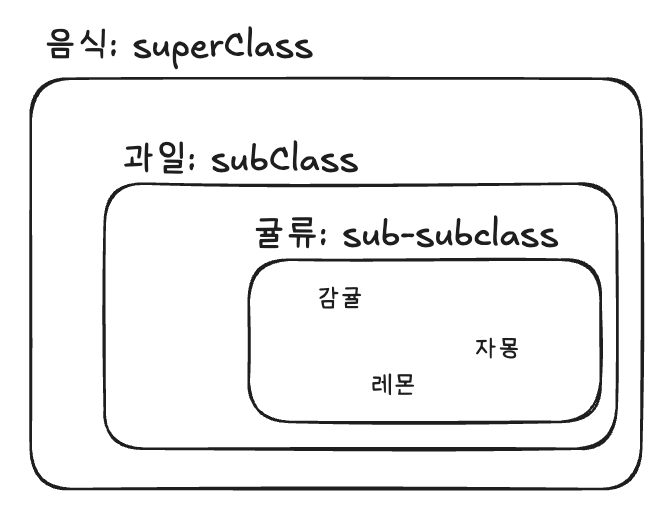
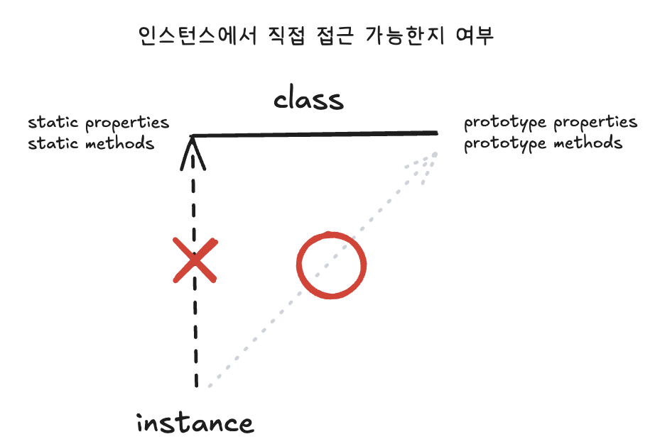

# 1. 클래스와 인스턴스의 개념 이해

| 용어                | 의미             | 설명                                                                        |
| ------------------- | ---------------- | --------------------------------------------------------------------------- |
| 클래스 (Class)      | 계급, 분류, 집단 | 프로그래밍에서도 동일한 개념으로 접근                                       |
| 인스턴스 (Instance) | 사례             | 클래스의 속성을 지니는 실존 개체<br>특정 조건(class)에 부합하는 구체적 예시 |

### 클래스의 계층적 특성



```
상위 개념
   └── 하위 개념 (상위 개념의 특성 포함 + 추가적인 구체적 특성)
```

### 현실세계 vs 프로그래밍의 클래스-인스턴스 관계

| 구분      | 현실세계                                       | 프로그래밍                             |
| --------- | ---------------------------------------------- | -------------------------------------- |
| 공통점    | 공통 요소를 지닌 집단을 분류하기 위한 개념     |
| 정의 방식 | 인스턴스 → 클래스 (인스턴스로부터 공통점 발견) | 클래스 → 인스턴스 (클래스 정의가 선행) |
| 생성 순서 | 인스턴스가 먼저 존재                           | 클래스가 먼저 정의되어야 함            |
| 특성      | 추상적 개념                                    | 상황에 따라 추상적/구체적              |

### 클래스 관계

- 인스턴스는 하나의 클래스만을 기반으로 생성
  - 생성 시점에서 호출 가능한 클래스는 단 하나
  - 다중상속 지원 여부와 무관
- 특정 언어에서는 다중 클래스 속성 가능 (단, 모든 클래스는 인스턴스의 '직계존속')

<br />

# 2. 자바스크립트의 클래스

| 구성 요소          | 설명                                       | 상속 여부 |
| ------------------ | ------------------------------------------ | --------- |
| 생성자 함수        | 클래스의 역할을 하는 함수                  | -         |
| prototype 프로퍼티 | 인스턴스에 상속되는 메서드들이 정의된 객체 | O         |
| 스태틱 멤버        | 생성자 함수의 직접적인 속성/메서드         | X         |

### 상속 관계에 따른 분류

| 멤버 종류                               | 상속 여부 | 접근 방식                   |
| --------------------------------------- | --------- | --------------------------- |
| 스태틱 멤버<br>(Static Member)          | X         | 클래스를 통해서만 접근 가능 |
| 프로토타입 메서드<br>(Prototype Method) | O         | 인스턴스에서 직접 접근 가능 |

> **주의사항**: 자바스크립트는 다른 언어와 달리 인스턴스에 직접 메서드를 정의할 수 있어, '인스턴스 멤버'라는 용어 사용 시 주의가 필요

### 클래스 관점에서 본 프로토타입 시스템

```javascript
/* 클래스 (생성자 함수) */
var Rectangle = function (width, height) {
  this.width = width;
  this.height = height;
};

/* 프로토타입 메서드 - 인스턴스에서 접근 가능 */
Rectangle.prototype.getArea = function () {
  return this.width * this.height;
};

/* 스태틱 메서드 - 클래스에서만 접근 가능 */
Rectangle.isRectangle = function (instance) {
  return (
    instance instanceof Rectangle && instance.width > 0 && instance.height > 0
  );
};

// 사용 예시
var rect1 = new Rectangle(3, 4);
console.log(rect1.getArea()); // 12
console.log(rect1.isRectangle(rect1)); // Error (x), isRectangle은 rect1.__proto__에도, rect1.__proto__.__proto__에도 없어서 undefined이 되는데 undefined은 함수가 아니라 실행할 수 없다는 에러가 발생
console.log(Rectangle.isRectangle(rect1)); // true
```

### 인스턴스에서의 부모 접근성



### 자바스크립트 클래스의 성격

| 역할         | 성격        | 상황                          |
| ------------ | ----------- | ----------------------------- |
| 틀(Template) | 추상적 개념 | 인스턴스의 메서드를 정의할 때 |
| 객체(Object) | 구체적 개체 | 스태틱 메서드를 호출할 때     |

- 하나의 클래스가 상황에 따라 추상적/구체적 성격을 모두 가질 수 있음
- 스태틱 메서드 호출 시 클래스 자체가 `this`가 됨
- 프로토타입 메서드는 인스턴스를 통해 접근 가능

<br />

# 3. 클래스 상속

## 3-1. 기본 구현

| 특징      | 설명                                    |
| --------- | --------------------------------------- |
| ES5까지   | 클래스 문법 없음                        |
| ES6 이후  | prototype 기반의 클래스 도입            |
| 상속 구현 | 프로토타입 체이닝을 통해 구현           |
| 한계점    | 완벽한 superclass, subclass 구현은 아님 |

### 프로토타입 체이닝을 활용한 상속 구현의 문제점

```javascript
var Grade = function(){
  var args = Array.prototype.slice.call(arguments)
  for(var i = 0; i < args.length; i++>){
    this[i] = args[i]
  }
  this.length = args.length
}
Grade.prototype = []; // 빈 배열을 참조시키는 방식의 상속 구현
var g = new Grade(100,80)
```

#### 문제점

1. **length 프로퍼티의 문제**

- configurable(삭제 가능)한 속성
- 의도치 않은 동작 가능성

2. **prototype 참조의 문제**

- 클래스(prototype)에 존재하는 값이 인스턴스의 동작에 직접적인 영향을 미침
- 이는 클래스가 가져야 할 추상성을 해치는 결과이며 완전한 클래스 체계라고 볼 수 없음

### prototype 체인을 활용한 일반적인 상속 구현 예제

```javascript
var Rectangle = function (width, height) {
  this.width = width;
  this.height = height;
};

Rectangle.prototype.getArea = function () {
  return this.width + this.height;
};

var Square = function (width) {
  Rectangle.call(this, width, width);
};

Square.prototype = new Rectangle();

var sq = new Square(5);
console.log(sq.getArea()); // 25
```

#### 발생 가능한 문제점

| 문제               | 설명                                                                    | 예시                         |
| ------------------ | ----------------------------------------------------------------------- | ---------------------------- |
| 프로토타입 값 간섭 | 인스턴스 속성 삭제 시 프로토타입의 값이 영향을 줌                       | sq.width 삭제 시 이상 동작   |
| 생성자 참조 오류   | constructor가 상위 클래스를 참조 (`sq.__proto__.__proto__.constructor`) | sq.constructor === Rectangle |

**[constructor 참조 오류 예시]**

```javascript
var rect2 = new sq.constructor(2, 3);
console.log(rect2); // Rectangle { width: 2, height: 3 }
```

### 상속 구현의 한계

| 구현 방식           | 장점        | 한계점                                       |
| ------------------- | ----------- | -------------------------------------------- |
| prototype 직접 할당 | 간단한 구현 | 프로토타입 값 오염<br> constructor 참조 문제 |

👉 하위 클래스로 삼을 생성자 함수의 prototype에 상위 클래스의 인스턴스를 부여하는 것만으로도 기본적인 메서드 상속은 가능하지만, 다양한 문제가 발생할 여지가 있어 구조적으로 안정성이 떨어짐

<br />

## 3-3. 클래스가 구체적인 데이터를 지니지 않게 하는 방법

### 프로토타입으로 클래스 상속 및 추성화를 흉내내기 위한 조건

1. SubClass.prototype의 `__proto__`가 SuperClass.prototype을 참조해야함
2. SubClass.prototype에 불필요한 인스턴스 프로퍼티가 없어야 함

### 클래스 상속 및 추상화 방법(1) - 인스턴스 생성 후 프로퍼티 일일이 지우고, 새로운 프로퍼티 추가할 수 없게 하기

```javascript
/* SuperClass, SubClass, SubClass에 추가할 메서드들이 정의된 객체 전달받기 */
var extendClass1 = function (SuperClass, SubClass, subMethods) {
  // 1. 프로토타입 상속
  SubClass.prototype = new SuperClass(); // 프로토타입으로 상속 받고싶은 생성자 함수의 인스턴스 연결하기

  // 2. 불필요한 프로퍼티 제거
  for (var prop in SubClass.prototype) {
    if (SubClass.prototype.hasOwnProperty(prop)) {
      delete SubClass.prototype[prop];
    }
  }

  // 3. constructor 복구
  SubClass.prototype.constructor = SubClass;

  // 4. 메서드 복사
  if (subMethods) {
    for (var method in subMethods) {
      SubClass.prototype[method] = subMethods[method];
    }
  }

  // 5. 프로토타입 동결
  Object.freeze(SubClass.prototype);
  return SubClass;
};

var Square = extendClass1(Rectangle, function (width) {
  Rectangle.call(this, width, width);
});
```

### 클래스 상속 및 추상화 방법(2) - 빈 함수를 활용하기

SubClass의 prototype에 직접 SuperClass의 인스턴스를 할당하는 대신,

아무런 프로퍼티를 생성하지 않는 빈 생성자 함수(Bridge)를 하나 더 만들어서 그 prototype에는 Bridge의 인스턴스를 할당

👉 인스턴스를 제외한 프로토타입 체인 경로 상, 구체적인 데이터가 남아있지 않게 된다.

```javascript
var extendsClass2 = (function () {
  var Bridge = function () {}; // 클로저로 활용
  return function (SuperClass, SubClass, subMethods) {
    Bridge.prototype = SuperClass.prototype;
    SubClass.prototype = new Bridge();

    // constructor 복구
    SubClass.prototype.constructor = SubClass;

    if (subMethods) {
      for (var method in subMethods) {
        SubClass.prototype[method] = subMethods[method];
      }
    }
    Object.freeze(SubClass.prototype);
    return SubClass;
  };
})();
```

> **의문점**: 결국 SubClass의 prototype에는 빈 객체가 할당되는건데, 문제 없나?
>
> 1. 프로토타입 체이닝은 `__proto__`를 따라 올라가며 메서드를 찾음
> 2. Bridge 함수의 prototype이 SuperClass.prototype을 참조하므로 정상적인 상속 가능
> 3. 빈 객체는 단순히 연결 고리 역할만 수행

### 클래스 상속 및 추상화 방법(3) - Object.create 활용

SubClass의 prototypedml `__proto__`가 SuperClass의 prototype을 바라보되, SuperClass의 인스턴스가 되지 않아 앞의 두 방법보다 간단하면서 안전

```javascript
var extendClass3 = function (SuperClass, SubClass, subMethods) {
  SubClass.prototype = Object.create(SuperClass.prototype);
  // constructor 복구
  SubClass.prototype.constructor = SubClass;
  if (subMethods) {
    for (var method in subMethods) {
      SubClass.prototype[method] = subMethods[method];
    }
  }
  Object.freeze(Squre.prototype);
  return SubClass;
};
```

> **의문점**: 이건 완벽한 방법일까? 단점은?
>
> 1. 모던 자바스크립트에서 가장 권장되는 방식
> 2. ES6의 class 문법도 내부적으로 유사한 방식 사용
> 3. 브라우저 지원 문제는 polyfill로 해결 가능

## 3-4. constructor 복구하기

SubClass 인스턴스와 SubClass.prototype 모두 독자적인 constructor가 없어 프로토타입 체이닝에 의해 SuperClass를 가리키게 되기 때문에,
SubClass.prototype.constructor = SubClass와 같이 constructor가 원래의 SubClass를 바라보도록 직접 참조를 복구 필요

## 3-5. 상위 클래스에서의 접근 수단 제공

```javascript
// extends 함수 내에서 다음 부분을 추가하여 상위 클래스의 메서드에 접근하여 사용할 수 있도록 추가 처리할 수 있음
SubClass.prototype.super = function (propName) {
  var self = this;
  if (!propName)
    // 상위 클래스의 생성자 return
    return function () {
      SuperClass.apply(self, arguments);
    };
  var prop = SuperClass.prototype[propName];
  if (typeof prop !== 'function') return prop;
  return function () {
    return prop.apply(self, arguments);
  };
};
```

# 4. ES6의 클래스 및 클래스 상속

```javascript
// ES5에서 class 구현 시
var ES5 = function (name) {
  this.name = name;
};
ES5.staticMethod = function () {
  return this.name + ' staticMethod';
};
ES5.method = function () {
  return this.name + 'method';
};
var es6Instance = new ES5('es5');
console.log(ES5.staticMethod()); // es5 staticMethod
console.log(es6Instance.method()); // es5 method

// ES6의 class 문법 사용 시
var ES6 = class {
  constructor(name) {
    this.name = name;
  }
  static staticMethod() {
    return this.name + ' staticMethod';
  }
  method() {
    return this.name + 'method';
  }
};
var es6Instance = new ES6('es6');
console.log(ES6.staticMethod()); // es6 staticMethod
console.log(es6Instance.method()); // es6 method

// ES6 class의 상속
var Rectangle = class {
  constructor(width, height) {
    this.width = width;
    this.height = height;
  }
  getArea() {
    return this.width * this.height;
  }
};

var Square = class extends Rectangle {
  constructor(width) {
    super(width, width);
  }
  getArea() {
    console.log('size is :', super.getArea());
  }
};
```
